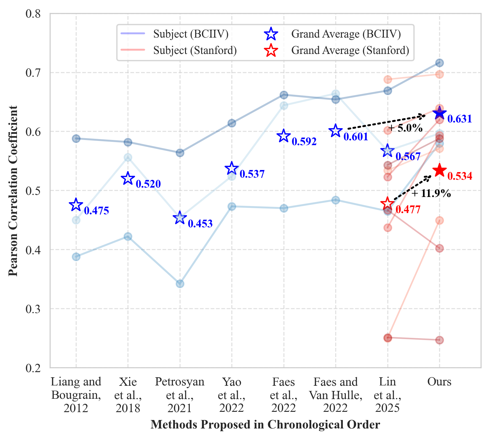
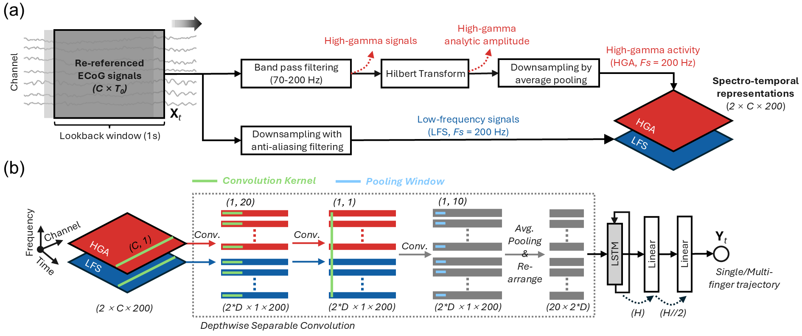

# 🌟Overview
This repository provides the official PyTorch implementation of the **Hi**gh-gamma and **Lo**w-frequency ECoG signal **Fus**ion **Net**work (**HiLoFuseNet**) proposed in the paper: 
>Sun et al., "Spectro-Temporal Fusion of High-Gamma and Low-Frequency ECoG Signals for Intracranial Finger Movement Decoding," 2025. *under review*.

which achieves SOTA decoding performance on the public BCI Competition IV and Stanford datasets, with Pearson correlation coefficients between true and predicted finger movement trajectories of 0.631 and 0.534, representing improvements of 5.0\% and 11.9\%, respectively, over the previous best methods.

## The proposed decoding framework
We aim to develop a performant and neurophysiologically-sound framework for continuous finger movement decoding from ECoG. This was achieved by proposing (a) a streamlined ECoG feature extraction pipeline and (b) a compact neural network for learning spectro-temporal information.

## The core takeaway functions
- High-Gamma Activity (HGA) and Low-Frequency Signals (LFS) extraction
  > finger_regression/models/prepareDataset.py/HGALFS_feature_extractor
- HiLoFuseNet architecture
  > finger_regression/models/nn_regressors.py/HiLoFuseNet

# 🚀Quick start
## 1. Download Datasets
- [BCIIV](https://www.bbci.de/competition/iv/#dataset4) 
- [Stanford-fingerflex.zip](https://searchworks.stanford.edu/view/zk881ps0522) 
## 2. Preprocessing
We used MATLAB [FieldTrip](https://www.fieldtriptoolbox.org/) to preprocess the raw ECoG signals. The preprocessing code can be found here:

- data_preprocessing/data_preprocessing_BCI4.m
- data_preprocessing/data_preprocessing_Stanford.m

## 3. Feature extraction
We used [MNE-Python (v1.8.0)](https://mne.tools/stable/index.html) to extract features for subsequent regression experiments. The code can be found here:

- finger_regression/prepare_taskFormatedData.py
  
## 4. Run experiments
All models were run in HPC with .slurm files for job array submission. The complete environment configuration file can be found here:

- finger_r/

| Experiment | Script | Raw output|
|-------------|-----------|-----------|
| Get DNN multi-output results | regression_o5_nn.py   submit_o5_nn.slurm | finger_regression/results/o5/varyingSeed|
| Get ML model multi-output results | regression_o5_ml.py   submit_o5_ml.slurm | finger_regression/results/o5|
| Interpret model learned representation| regression_o5_nn_interpretModel.py   submit_o5_nn_interpretModel.slurm | finger_regression/results/o5/interpretModel|
| Ablation study| regression_o5_nn_ablation.py   submit_o5_nn_ablation.slurm | finger_regression/results/o5/ablation|
| Test hyperparameter| regression_o5_nn_hyperparameter.py   submit_o5_nn_hyperparameter.slurm | finger_regression/results/o5/hyperparameter|
| Get DNN single-output results| regression_o1_nn.py   submit_o1_nn.slurm | finger_regression/results/o1/varyingSeed|
