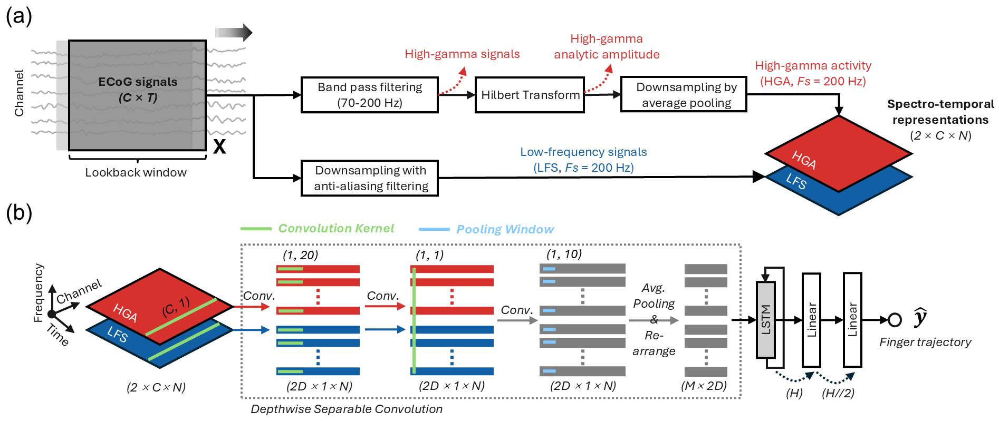

## 🧠 **Hi**gh-gamma and **Lo**w-frequency ECoG signal **Fus**ion **Net**work (**HiLoFuseNet**) for **continuous finger movement decoding**
This repository provides the official PyTorch implementation of the finger movement decoding framework detailed in the paper:
> Sun et al., "Spectro-Temporal Fusion of High-Gamma and Low-Frequency ECoG Signals for Intracranial Finger Movement Decoding," 2026. *under review*.

The current manuscript is available here. This version extends the original TechRxiv preprint by:
- Discussing the impact of lookback windows.
- Including additional decoder baselines.
- Standardizing the decoding framework to ensure it is strictly causal.

---
## 🛠️ Decoding Framework
The proposed framework is characterized by (a) a streamlined ECoG feature extraction pipeline and (b) a compact neural network for learning spectro-temporal information.



### Core Functions

| Functionality | Implementation Path |
| :--- | :--- |
| HGA and LFS Feature Extraction | `finger_regression/models/prepareDataset.py/_extract_hga_lfs` |
| HiLoFuseNet Architecture | `finger_regression/models/nn_regressors.py/HiLoFuseNet` |

---

## 💾 Steps to reproduce and visualize the results

### 1. Download Datasets
* BCIIV: [https://www.bbci.de/competition/iv/#dataset4](https://www.bbci.de/competition/iv/#dataset4)
* Stanford-FingerFlex: [https://searchworks.stanford.edu/view/zk881ps0522](https://searchworks.stanford.edu/view/zk881ps0522)

### 2. Signal Preprocessing
Raw ECoG signals were preprocessed using **MATLAB FieldTrip-20230926**.
* BCIIV Preprocessing: `data_preprocessing/data_preprocessing_BCI4.m`
* Stanford Preprocessing: `data_preprocessing/data_preprocessing_Stanford.m`

### 3. Run Experiments
Configure the pytorch environment via `finger_regression/environment.yml`. The following table summarizes the scripts used to reproduce the paper's finding. The .slum file provides the code to interact with a supercomputing cluster. If you run the script locally, please change the inputs in the .py file according to the corresponding settings from the .slurm file. 

$\color{red}{\text{Check the source data:}}$ Raw output files are provided in `finger_regression/results` </font>. 

| Experiment | Execution Script(s) | Results Folder |
| :--- | :--- | :--- |
| DNNs | `regression_o5_nn.py`, `submit_o5_nn.slurm` | `finger_regression/results/o5/varyingWindow` |
| MLs | `regression_o5_ml.py`, `submit_o5_ml.slurm` | `finger_regression/results/o5` |
| Model Interpretation | `regression_o5_nn_interpretModel.py`, `submit_o5_nn_interpretModel.slurm` | `finger_regression/results/o5/interpretModel` |
| Ablation Study | `regression_o5_nn_ablation.py`, `submit_o5_nn_ablation.slurm` | `finger_regression/results/o5/ablation` |
| Hyperparameter Test | `regression_o5_nn_hyperparameter.py`, `submit_o5_nn_hyperparameter.slurm` | `finger_regression/results/o5/hyperparameter` |

### 4. Visualization
We provide visualization scripts in folder `visualization_scripts`. Based on the source data from step 3, you could generate all figures in our paper. 

## Acknowledgement
A sincere thanks to the code contributors of BTTR, HOPLS, and DeepFingerNet.
* BTTR: [https://github.com/TheAxeC/block-term-tensor-regression](https://github.com/TheAxeC/block-term-tensor-regression)
* HOPLS: [https://github.com/arthurdehgan/HOPLS](https://github.com/arthurdehgan/HOPLS)
* DeepFingerNet: [https://github.com/UM-Tao/DeepFingerNet](https://github.com/UM-Tao/DeepFingerNet)

## ⚠️ We need you
We benchmarked a large number of decoders across the BCIIV and Stanford fingerflex datasets. Since most of them did not open-source their code, despite our best efforts to replicate the reported results, the discrepancies we observed were substantial. If u have suggestions to improve the code, please contact us.

## Citation
Hope this model helps your research. We would appreciate if u cite us.

```
@article{sun2025spectro,
  title={Spectro-temporal fusion of high-gamma and low-frequency ecog signals for intracranial finger movement decoding},
  author={Sun, Qiang and Merino, Eva Calvo and Dyck, Bob Van and Yang, Yuan and He, Jiayuan and Hulle, Marc M Van},
  year={2025},
  publisher={TechRxiv}
}
